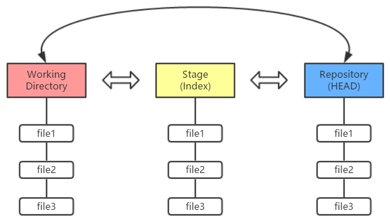

Git 和其它版本控制系统（包括 Subversion 和近似工具）的主要差别在于 Git 对待数据的方法。 概念上来区分，其它大部分系统以文件变更列表的方式存储信息。
<!-- more -->
## 配置
- 修改自己的用户名和邮箱地址
```
git config --global user.name"xxx"
git config --global user.email "xxx"
```
- 查看配置
```
git config --list
```
## 理论


- 工作区域（`Working Directory`）就是你平时存放项目代码的地方。

- 暂存区域（`Stage`）用于临时存放你的改动，事实上它只是一个文件，保存即将提交的文件列表信息。

- Git 仓库（`Repository`）就是安全存放数据的位置，这里边有你提交的所有版本的数据。其中，HEAD 指向最新放入仓库的版本。
- Git 管理的文件有三种状态：已修改（`modified`）、已暂存（`staged`）和已提交（`committed`）

### Ex: 将工作目录的文件放到 Git 仓库
```
git add .
git commit -m [message]
```
or more simple
```
git commit -am [message]  
```

## 查看信息
|order       | description           |
|-|-|
|       git status      |          显示有变更的文件  |
|git log| 显示当前分支的版本历史|
|git reflog|显示当前分支的最近几次提交，包括已经被`reset`删除的|
|git diff| 显示暂存区和工作区的代码差异|
|    git diff [快照ID] [快照ID]           | 显示两个快照之间的差异       |
|    git diff [快照ID]    | 显示工作区和快照之间的差异       |
|git diff --cached [快照ID] |显示暂存区和快照之间的差异|

>git log 可添加  --oneline  只一行显示  --graph 图形化显示 --all 显示所有分支
## Stage 与 Working Directory 之间增加 / 删除文件
|order       | description           |
|-|-|
|       git add [file1] [file2] ...     |          添加指定文件到暂存区  |
|git rm [file1] [file2] ...|删除工作区文件，并且将这次删除放入暂存区|
|git rm --cached [file]|停止追踪指定文件，但该文件会保留在工作区|
|git mv [file-original] [file-renamed]|改名文件，并且将这个改名放入暂存区|

## 代码提交
|order       | description           |
|-|-|
|     git commit -m [message]     |        提交暂存区到仓库区   |
| git commit --amend -m [message]|使用一次新的commit，替代上一次提交| 

## 撤销
|order       | description           |
|-|-|
|    git checkout -- [file]  |      恢复暂存区的指定文件到工作区   |
|    git reset HEAD [file]  |     清空`add`命令向暂存区提交的关于file文件的修改 |
|  git reset HEAD~n      |     移动` HEAD`的指向，将其指向上`n`个快照` HEAD`；然后再将该位置的快照回滚到暂存区域。 |   
| git reset --soft HEAD~ |          只移动` HEAD`的指向，但并不会将快照回滚到暂存区域  |   
| git reset --hard HEAD~ |          不仅移动` HEAD`的指向，将快照回滚动到暂存区域，还将暂存区域的文件还原到工作目录  |  
| git reset xxxxxx |       回滚到指定快照  |    

## 分支
### 实际开发中的分支管理


- 常设分支就主分支（master）和开发分支（develop）
- 临时分支有功能分支（feature）、预发布分支（release）和维护分支（hotfix），用完之后应该及时删除

|order       | description           |
|-|-|
|    git branch [branch-name]  |  新建一个分支，但依然停留在当前分支   |
|git checkout [branch-name]|切换到指定分支，并更新工作区|
|git checkout -b [branch]|新建一个分支，并切换到该分支|
|git branch -d [branch-name]|删除分支|
|git checkout --orphan [branch] |基于当前所在分支新建一个赤裸裸的分支，没有任何的提交历史|
| git merge [branc|合并指定分支到当前分支|

## 远程同步


|order       | description           |
|-|-|
|git remote show [remote]|显示某个远程仓库的信息|
|git remote add [shortname] [url]|增加一个新的远程仓库，并命名|
|git pull [remote] [branch]|取回远程仓库的变化，并与本地分支合并|
|git push [remote] [branch]|上传本地指定分支到远程仓库|
