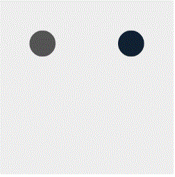
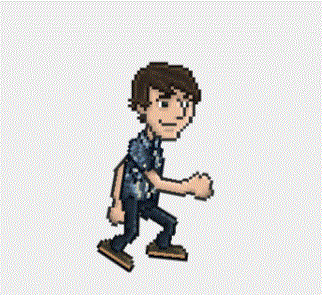

CreateJS是基于HTML5开发的一套模块化的库和工具。
基于这些库，可以非常快捷地开发出基于HTML5的游戏、动画和交互应用。
<!-- more -->

CreateJS主要包含如下四个类库：
- EaselJS – 简化处理HTML5画布（核心）
- TweenJS – 用来帮助调整HTML5和Javascript属性
- SoundJS – 用来简化处理HTML5 audio
- PreloadJS – 帮助管理和协调加载中的一些资源

Demo源码: https://github.com/iaaiNG/CreateJs
# EaselJS

>EaselJS 是一个JavaScript库,用来简单快捷的操作 HTML5 Canvas 标签。在创建H5游戏，生成艺术作品、处理其他高级图形化等工作中有着很友好的体验。

## 容器 Stage 和 Container
`Stage`是root级容器的显示列表, 区别于`Container`, 都可以承载各种集成自`DisplayObject`的类如`Shape`和`Container`, 通过`update`方法将图形渲染在canvas上。
```javascript
\\ 创建舞台
let stage = new createjs.Stage("canvas")  
\\ 创建Text实例
let text = new createjs.Text("hello easeljs","36px Arial","#777")
\\ 将Text实例添加到舞台
stage.addChild(text);
\\ 渲染canvas
stage.update()
```
### 基础方法 — DisplayObject
methods | parameters type | returns | description
-|-|-|-
addChild(child) |  DisplayObject | (child) DisplayObject | 将DisplayObject实例添加到显示列表 |
addChildAt(child, index) |  DisplayObject; Number | (child) DisplayObject | 将DisplayObject实例添加到显示列表指定位置 |

### 基础属性 — DisplayObject
properties | type | default | description
-|-|-|-
children | Array | null | 容器显示列表的数组集合
alpha | Number | 1 | 透明度0~1 |
x | Number | 0 | 容器绘制原点的x坐标 |
y | Number | 0 | 容器绘制原点的y坐标 |

## 绘制图形 Shape + Graphics
创建一个`Shape`实例, 一个可以承载各种图形的DisplayObject对象, 它的graphics属性是`Graphics`对象的暴露了所有图形方法。
```javascript
 var graphics = new createjs.Graphics().beginFill("#ff0000").drawRect(0, 0, 100, 100);
 var shape = new createjs.Shape(graphics);

 //或者可以利用Shape类上的graphics的原型方法, 渲染出与上面一样的效果
 var shape = new createjs.Shape();
 shape.graphics.beginFill("#ff0000").drawRect(0, 0, 100, 100);
```
### 图形方法 — Graphics
methods | parameters type | returns | description
-|-|-|-
beginFill(color)  |  string | Graphics实例本身  | 指定填充的颜色 |
beginStroke(color)  |  string | Graphics实例本身  | 指定描边的颜色 |
endFill() | \ | Graphics实例本身  | 等同于 beginFill(null) |
endStroke() | \ | Graphics实例本身  | 等同于 beginStroke(null) |
drawRect (x, y, w, h) | Number | Graphics实例本身  | 绘制矩形 |
setStrokeStyle(thickness) | Number | Graphics实例本身 | 设置描边宽度 |
drawCircle (x, y, radius) | Number | Graphics实例本身 | 绘制圆形 |
lineTo(x, y) | Number | Graphics实例本身 | 绘制路径  |
moveTo(x, y) | Number | Graphics实例本身 | 移动绘制原点到指定点 | 
closePath() | \ | Graphics实例本身 | 闭合当前路径 | 

## 事件
事件绑定方式
```javascript
 displayObject.addEventListener("click", handleClick);
 function handleClick(event) {
    // Click happened.
 }
 var listener = myBtn.on("click", handleClick, null, false, {count:3});
  function handleClick(evt, data) {
      data.count -= 1;
      console.log(this == myBtn); // true - scope defaults to the dispatcher
      if (data.count == 0) {
          alert("clicked 3 times!");
          myBtn.off("click", listener);
          // 或者利用 evt.remove() 移除事件监听 
      }
  }
```

### 事件方法 — DisplayObject
methods | parameters type | returns | description
-|-|-|-
addEventListener(type, listener, [事件冒泡])  |  String, Function\Object, Boolean | listener | 添加指定事件监听 |
removeEventListener(type, listener, [事件冒泡]) |  String, Function\Object, Boolean | \ | 移除指定事件监听 |
removeAllEventListeners ( [type] ) |  String | \ | 移除所有事件或者指定类型的所有事件监听 |
on(type, listener, [scope], [once=false], [data], [useCapture=false] ) | String, Function\Object ,Object, Boolean, params, Boolean | listener | 添加事件监听快捷方式 | 
off(type, listener, [事件冒泡]) |  String, Function\Object, Boolean | \ | 移除指定事件监听快捷方式 |
hasEventListener(type) | String | false/true | 检查是否监听指定事件 |

### 事件类型
event |　description
-|-
click | 单击
dblclick | 双击
mousedown | 按下
mouseout | 离开目标范围(默认禁用, 需要设置enableMouseOver属性启用)
mouseover | 进入目标范围(默认禁用, 需要设置enableMouseOver属性启用)
pressmove | 按下移动
pressup | 松开按下
tick | 舞台更新时触发

## 断续器 Ticker Class
Ticker是一个静态类，提供了好多静态方法和属性，不要去实例化它。

### 属性
properties | type | default | description
-|-|-|-
framerate | Number | \ | 帧率
timingMode | String | Ticker.TIMEOUT | 指定计时API和模式(setTimeout\requestAnimationFrame)

>CreateJs 提供了两种渲染模式，一种是用 setTimeout ，一种是用 requestAnimationFrame ，默认是 setTimeout ，默认的帧数是 20 ，一般的话还没有什么区别，但是如果动画多的话，设置成 requestAnimationFrame 模式的话，就会感觉到动画如丝般的流畅。

```javascript
createjs.Ticker.timingMode = createjs.Ticker.RAF;
```

## 文本绘制 Text Class
```javascript
var text = new createjs.Text("Hello World", "20px Arial", "#ff7700");
```

### 方法
methods | parameters type | returns | description
-|-|-|-
getMeasuredHeight() | \ | 文本测量的高度值 | 获取文本的近似高度 |
getMeasuredWidth() | \ | 文本测量的宽度值 | 获取文本的近似宽度 |

### 属性
properties | type | default | description
-|-|-|-
color | String | \ | 字体颜色(ex. "#fff")
font | String | \ | 字体样式(ex. "bold 36px Arial")
lineHeight  | Number | \ | 字体行高
lineWidth | Number | \ | 字体行宽
text | String | \ | 文本内容
textAlign |String | left | 文本水平对齐方式(right start end center)
outline | Number | \ | 指定描边粗细显示字体

## 图像绘制 Bitmap Class

图片, 视频, 乃至canvas, 都可以添加到Bitmap Class的显示列表上。
注意: 需要图片加载完成后, 再来更新舞台, 才能让图片显示。 
```javascript
var bitmap = new createjs.Bitmap("imagePath.jpg");
// 或者
var img = new Image()
img.src = "image.jpg"
var bitmap = new createjs.Bitmap(img)
```

## 影片剪辑 MovieClip Class

```javascript
var stage = new createjs.Stage('canvas')
createjs.Ticker.timingMode = createjs.Ticker.RAF;
createjs.Ticker.addEventListener('tick', stage)
var prop = {
    labels: { start: 50 }, 
    loop: true
}
var mc = new createjs.MovieClip(prop)
stage.addChild(mc)
var state1 = new createjs.Shape(new createjs.Graphics().beginFill('#123').drawCircle(0, 100, 30))
var state2 = new createjs.Shape(new createjs.Graphics().beginFill('#555').drawCircle(0, 100, 30))
mc.timeline.addTween( createjs.Tween.get(state1).to({ x: 30 }).to({ x: 370 }, 100).to({ x: 30 }, 100) )
mc.timeline.addTween( createjs.Tween.get(state2).to({ x: 370 }).to({ x: 30 }, 100).to({ x: 370 }, 100) )
mc.gotoAndPlay("start")
```


## 精灵 Sprite Class
Sprite继承自DisplayObject, 可以显示来自SpriteSheet的实例，
SpriteSheet Class封装了相关的API和属性, 利用一帧帧图像拼凑的图, 来生成精灵动态图。
传递给SpriteSheet构造函数的数据定义: 
- images: 图像url。
- frames: 单帧图像的位置。
- animations: 命名动画名的帧序列, 可选。
- framerate: 目标播放帧率FPS,可选。
```javascript
var stage = new createjs.Stage('canvas')

var ss = new createjs.SpriteSheet({
    images:["./img/spritesheet_grant.png"],
    frames:{
        height: 292.5,
        width: 165.75,
        count:64
    },
    animations:{
        run:[0,25,"jump",1.5],
        jump:[26,63,"run"]
    }
})

var s = new createjs.Sprite(ss, "run")

stage.addChild(s)
createjs.Ticker.timingMode = createjs.Ticker.RAF;
createjs.Ticker.addEventListener('tick', stage)
```


## Dom元素 DOMElement Class
DOMElement可以将HTMLElement转换成DisplayObject对象(不完整), 因此它可以被添加到舞台。然而, 它并没有被渲染到画布上。
```javascript
var domElement = new createjs.DOMElement(htmlElement);
\\ DOMElement实例不是完整的EaselJS显示对象，要从DOMElement获取鼠标事件，您必须向htmlElement添加处理程序。
domElement.htmlElement.onclick = function() {
     console.log("clicked");
}
```

# TweenJS
>TweenJS Javascript库提供了一个简单但功能强大的tweening接口。它支持数值对象属性和CSS样式属性的渐变，并允许链式调用，以创建复杂的动画。
## TweenJs Class
Tweens属性作用于单个目标，方法链式调用以创建复杂的动画序列
Example: 
```javascript
createjs.Tween.get(target)
    .wait(500)
    .to({alpha:0, visible:false}, 1000)
    .call(handleComplete);
```
### get(target, [props])
返回一个新的`tween`实例。这在功能上与使用`new Tween(…)`是相同的，但是使用TweenJS的链式语法看起来更整洁。
Parameters:
- target | Object
tween 目标
- [props] | Object  optional
应用于此实例的配置属性(例如{loop:-1, pause:true})。支持的常用可选属性如下所示:

properties | parameters type | description
-|-|-
[loop=0] | Boolean  Number | 循环次数，设置为true，则永久循环
[reversed=false] | Boolean | 反向播放
[timeScale=1] | Number|播放倍率
[paused=false] | Boolean |暂停或取消暂停
[onChange] | Function |添加change事件
[override=false] | Boolean optional|当设置为true时, 移除目标现有Tween操作

### to(props, [duration=0], [ease="linear"])
改变目标指定属性值, 并在定义时间内渐变去显示。
Example
```javascript
createjs.Tween.get(target).to({alpha:0, visible:false}, 1000);
```
### 方法 Methods
methods | parameters type | returns | description
-|-|-|-
label(name) | String | Tween实例 | 添加一个标签, 可以供gotoAndPlay/gotoAndStop使用
wait ｜Number | Tween实例 | 添加一个等待时间
pause | Tween | Tween实例 | 添加暂停指定Tween的操作


## Ease Class
Ease类提供了一系列用于TweenJS的Ease函数。

大多数关于Ease的方法可以直接作为easing函数传递:
```javascript
createjs.Tween.get(target).to({x:100}, 500, createjs.Ease.linear);
```
有关Ease类型的概述，访问: https://www.createjs.com/#demos/tweenjs/tween_sparktable

## 运动指南插件 MotionGuidePlugin Class
用于自定义对象的运动轨迹
要在TweenJS加载完成, 然后安装插件使用
```javascript
createjs.MotionGuidePlugin.install();
```
Example
```javascript
// Using a Motion Guide 用法
createjs.Tween.get(target).to({guide:{ path:[0,0, 0,200,200,200, 200,0,0,0] }},7000);
// Visualizing the line 可视化路径
graphics.moveTo(0,0).curveTo(0,200,200,200).curveTo(200,0,0,0);
```