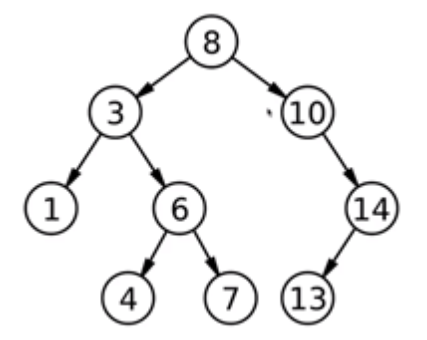

二叉树是一种数据结构，通过比较数据的重要性，让数据像树杈一样呈现。然后利用二叉树的特性对数据进行排序，其效率比起冒泡排序高得多。
<!-- more -->

# 概念
- 某个节点最多有两个子节点的树。常用于排序。效率较高。
- 节点中的值：键, key。
- 兄弟节点：拥有同一个父节点的节点。
- 根节点：没有父节点
- 叶子节点: 没有子节点。
- 中间节点: 有子节点。
- 高：节点都有深度，最大的节点深度即为这棵树的高。
- 排序二叉树：节点左孩子的值小于它，右孩子的值大于它。显然，左子树的节点值都比当前节点小，右子树的逗比当前节点大。

# 通过javascript实现二叉树结构
#### 需求
1. 新建一个空的二叉树: `var binaryTree = new BinaryTree();`;
2. 插入新的节点:  `binaryTree.insert(key)`
#### 思路
1. 确定单个节点属性：
   1. `this.key` 当前节点key值
   2. `this.left` 指向左子节点
   3. `this.right` 指向右子节点
2. 提供插入节点的方法
```js
function BinaryTree() {
  var Node = function (key) {
    this.key = key;
    this.left = null;
    this.right = null;
  }
  var root = null;
  var insertNode = function (node, newNode) {
    if (newNode.key < node.key) {
      if (node.left === null) {
        node.left = newNode
      } else {
        insertNode(node.left, newNode)
      }
    } else {
      if (node.right === null) {
        node.right = newNode
      } else {
        insertNode(node.right, newNode)
      }
    }
  }
  this.insert = function (key) {
    var newNode = new Node(key);
    if (root === null) {
      root = newNode
    } else {
      insertNode(root, newNode)
    }
  }
}
```
# 遍历二叉树节点
思路：使用递归遍历
#### 中序遍历
- 遍历顺序：左子节点（树）->当前节点->右子节点（树）
- 升序访问每一个节点
```js
var inOrderTraverseNode = function (node, callback) {
  if (node !== null) {
    inOrderTraverseNode(node.left, callback)
    callback(node.key);
    inOrderTraverseNode(node.right, callback)
  }
}
this.inOrderTraverse = function (callback) {
  inOrderTraverseNode(root, callback)
}
```
#### 前序遍历
- 遍历顺序：当前节点->左子节点（树）->右子节点（树）
- 适合进行排序二叉树的复制，效率比创建一棵同样的二叉树高
```js
var preOrderTraverseNode = function (node, callback) {
  if (node !== null) {
    callback(node.key)
    preOrderTraverseNode(node.left, callback)
    preOrderTraverseNode(node.right, callback)
  }
}

this.preOrderTraverse = function (callback) {
  preOrderTraverseNode(root, callback)
}
```
#### 后序遍历
- 遍历顺序：左子节点（树）->右子节点（树）->当前节点；
- 适合进行文件系统的遍历。
```js
var postOrderTraverseNode = function (node, callback) {
  if (node !== null) {
    postOrderTraverseNode(node.left, callback)
    postOrderTraverseNode(node.right, callback)
    callback(node.key)
  }
}

this.postOrderTraverse = function (callback) {
  postOrderTraverseNode(root, callback)
}
```
# 二叉树节点的查找
#### 最小值
思路：根据二叉树的性质，查找二叉树中最左的节点；
```js
var minNode = function (node) {
  if (node) {
    while (node && node.left !== null) {
      node = node.left
    }
    console.log(node.key)
  }
  return null
}
this.min = function () {
  minNode(root)
}
```
#### 最大值
思路：相当于查找二叉树中最右的节点
```js
var maxNode = function (node) {
  if (node) {
    while (node && node.right !== null) {
      node = node.right
    }
    console.log(node.key)
  }
  return null
}
this.max = function () {
  maxNode(root)
}
```
#### 指定值
思路：比较节点的key值，决定向左或向右查找
```js
var searchNode = function (node, key) {
  while (node) {
    if (node.key === key) {
      return node
    }
    if (node.key < key) {
      node = node.right
    } else {
      node = node.left
    }
  }
  return null
}
this.search = function (key) {
  return searchNode(root, key)
}
```
# 二叉树节点的删除
#### 思路1: 简化，单考虑叶子节点的删除
1. 找到目标节点node, 使 node = null
2. 使目标节点的父节点, 指向 left/right = null
```js
var removeNode = function (node, key) {
  if (node === null) {
    return null
  }
  if (key < node.key) {
    node.left = removeNode(node.left, key)
    return node  // 返回当前节点，以便找到目标后递归返回的时候可以满足：node.left = node.left.left
  } else if (key > node.key) {
    node.right = removeNode(node.right, key)
    return node  
  } else {
    if (node.left === null && node.right === null) {
      node = null
      return node
    }
  }
}
this.remove = function (key) {
  return removeNode(root, key)
}
```
#### 思路2: 加入中间节点的删除
1. 要删除的目标节点下包含一个子节点left or right
   1. 使目标节点等于子节点
2. 要删除的目标节点下包含两个子节点left and right
   1. 查询目标节点的右子节点的最左节点key, 使其等于目标节点的key
   2. 删除目标节点的右子节点的最左节点
```js
var removeNode = function (node, key) {
  if (node === null) {
    return null
  }
  if (key < node.key) {
    node.left = removeNode(node.left, key)
    return node  // 返回当前节点，以便找到目标后递归返回的时候可以满足：node.left = node.left.left
  } else if (key > node.key) {
    node.right = removeNode(node.right, key)
    return node  
  } else {
    if (node.left === null && node.right === null) {
      node = null
      return node
    }
    // 加入中间节点的删除, start
    if (node.left === null) {
      node = node.right
      return node
    } else if (node.right === null) {
      node = node.left
      return node
    }
    var aux = findMinNdde(node.right)
    node.key = aux.key
    node.right = removeNode(node.right, aux.key)
    return node
    // 加入中间节点的删除, end
  }
}
this.remove = function (key) {
  return removeNode(root, key)
}
```