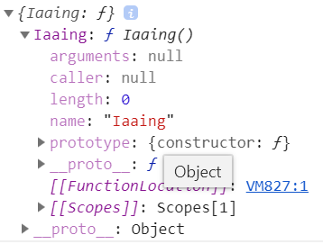
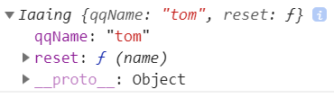
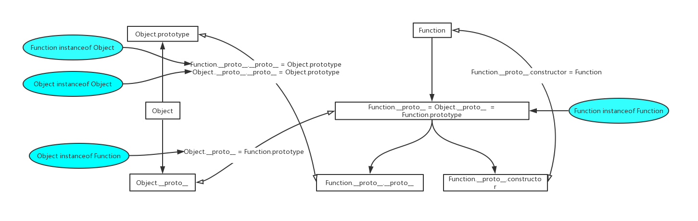

JS原型, 原型链的本质, 重新梳理一下。(纯属个人理解)
<!--more-->

# 示例
```js
function Iaaing() {
  this.qqName = "tom"
  this.reset = function (name) {
    this.qqName = name
    return this.qqName
  }
  window.self = this
  return "a fun"
}
Iaaing.prototype.age = 18
Iaaing.job = "engineer"
```
***Iaaing 是一个函数, 也是一个构造函数, 还是一个对象(万物皆对象)***

# Iaaing 是函数

* 众所周知，它可以函数式调用
```js
Iaaing() // a fun
```
* 内部的this指向 window
```js
self === window // true
```
* 尝试访问属性
```js
Iaaing.qqName  // undefined
self.qqName  // tom
var name = self.reset("jerry")
self.qqName === name  // true
```
***结论：***
1. 当执行了Iaaing()后，this指向window全局，但是并没有创建实例，只是在window实例下添加了相应属性和方法。
2. 与其说它是函数，还不如说是全局对象 window 的一个方法
3. 其中Iaaing.qqName并没有报错，说明Iaaing也是一个对象，可以通过输出{Iaaing}查看；
4. 可以理解成这样：
```js
window = {
  Iaaing:function(){
    this.qqname="tom"
  }
}
window.Iaaing()
// window = {
//   Iaaing:function(){
//     this.qqName = "tom"
//   },
//   qqName = "tom"
// }
```

# Iaaing 是构造函数
- 构造函数配合操作符`new`，能生产出实例
```js
var jkm = new Iaaing
```
这样`jkm`成为Iaanig的实例，探究一下构造函数的数据结构



***可以看出，构造函数和普通的对象的区别就是，它声明完毕后就带上一个复杂的属性：`prototype`***  
***里面包含了：Iaaing.prototype.constructor === Iaaing***

- 查看this指向
```js
self === jkm  // true
```

***new 做的事情：在构造函数Iaaing调用过程中把`this`指向`jkm`***

- 看看实例`jkm`的数据结构



***实例`jkm`除了本身定义的属性，还多了一个__proto__的东西。***

- 通过下面的验证，得知实例的__proto__，就是构造函数的原型(prototype)
```js
jkm.__proto__ === Iaaing.prototype  // true 
```


- 实例可以继承构造函数的原型，体现在实例的__proto__属性

```js
jkm.constructor === Iaaing  // true 
```
***jkm实例对象本身没有constructor属性，但是通过继承Iaaing的原型，可以在__proto__里拿到constructor属性***

- 尝试访问属性
```js
jkm.qqName  // tom
jkm.age  // 18
jkm.job  // undefined
Iaaing.age // undefined
```
很显然，jkm经过实例之后，只有属性qqName和age能在对象的直接属性或者一层层的原型链__proto__里找到

## 构造函数定义在哪里?
- 先来看个示例，首先函数对象实际是存储在内存中，A和B只不过是指向内存的变量
```js
function A(){ this.w = "a" }
function B(){ this.w = "b" }
```
- 函数A的原型里有个叫构造函数的东西指向的是A，所以A本身就是构造函数
```js
A.prototype.contructor === A // true
```
- 这里就有个问题了，当我们使用new的时候，调用的是A.prototype.contructor还是A本身呢？
```js
var t1 = new A  // { w:"a" }
A.prototype.contructor = B  // ƒ B(){ this.w = "b" }
var t2 = new A  // { w:"a" }
A // ƒ A(){ this.w = "a" }
```
***通过上面验证，即使使A.prototype.contructor = B，当使用new的时候，就是调用函数A本身，也就是new做的事情：A.call(this)***
***推出结论：构造函数就是通过变量声明的函数本身***

# 结论：new 做了哪些事
模拟声明 `function Iaaing(){}` 的过程
```js
window:{
  Iaaing:  // ƒ()
  {
    prototype : {
      constructor : Iaaing;
    }
    __proto__ : Function.prototype
  }
}
```

1. 创建新的空对象: `var jkm = {}` ;
2. Iaaing 的原型对象的构造函数构造 jkm 时，jkm 会自动继承的原型对象: `jkm = { __proto__: Iaaing.prototype }` ;
3. 调用 Iaaing 的构造函数，把 this 指向 jkm，也就是`Iaaing.call(jkm)`;
4. 返回新对象地址，保存到变量 jkm 中

# 补充
## 构造函数里的return
在JavaScript构造函数中：
- 如果return原始类型，那么对构造函数没有影响，实例化对象返回空对象；
```js
function A(){
  return "jkm"
}
var a = new A
a instanceof A // true
```
- 如果return引用类型（数组，函数，对象），那么实例化对象就会返回该引用类型。
```js
function B(){
  return [1,2,3]
}
var a = new B
a instanceof B // false
a instanceof Array // true
```

## 刨根挖底
- 谁是最终的构造函数?
```js
function A(){}  
var a = new A
a.constructor === A  // true 
A.constructor === Function  //true A既是a的构造函数又是Function的实例
Function.constructor === Function // true Function的构造函数是它本身
Object.constructor === Function  // true 
Array.constructor === Function  // true 
String.constructor === Function  // true 
Number.constructor === Function  // true 
...
```
***说明一切对象最终的构造函数都是Function，当new Function()生产一个构造函数对象时，就会自动获得prototype属性，并成为下一个new它产生的构造函数***
- 谁是最终的原型?
```js
function A(){}  
var a = new A
a.__proto__ === A.prototype  //true
A.prototype.__proto__ === Object.prototype  //true
Object.prototype.__proto__ === null  //true

A.__proto__ === Function.prototype  //true
Function.prototype.__proto__ === Object.prototype  //true
Object.prototype.__proto__ === null  //true

Function.__proto__ === Function.prototype  //true
Function.prototype.__proto__ === Object.prototype  //true
Object.prototype.__proto__ === null  //true
```
***说明一切对象最终的原型都是Object.prototype，除了Object.create(null)***
- 图解Function和Object 的关系
