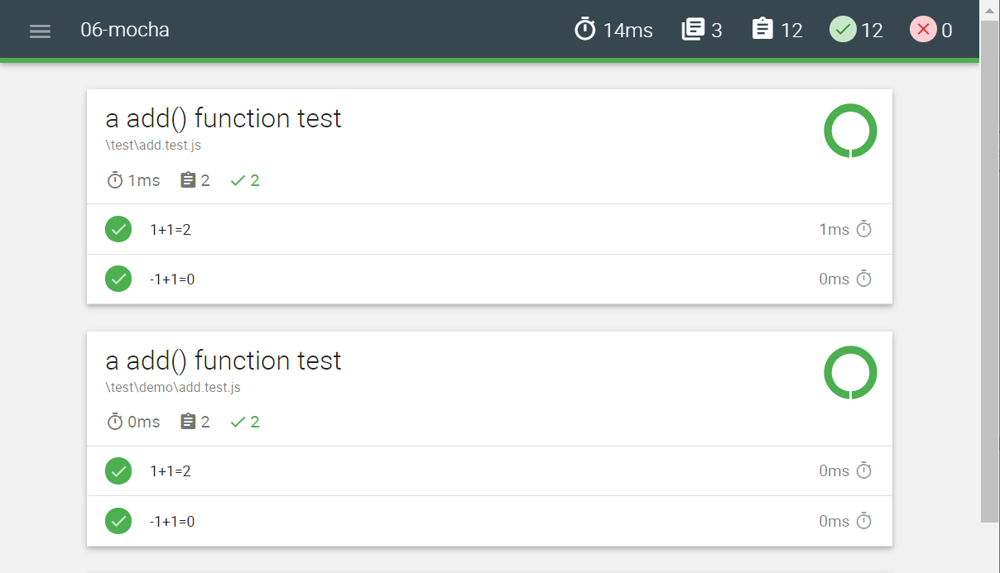
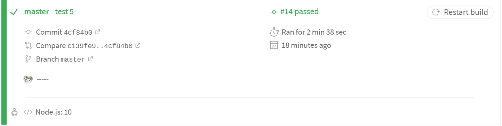

首先声明一点，前端开发的单元测试并不是在前端的开发过程中所必须的。但是随着每个工程的复杂化、代码的高复用性要求和前端代码模块之间的高内聚低耦合的需求，前端工程中的单元测试流程就显得很有必要。
<!--more-->

# BDD和TDD
**BDD：** Behavior Driven Development,行为驱动开发是一种敏捷软件开发的技术，它鼓励软件项目中的开发者，QA和非技术人员之间的协作。

**TDD：** Test-Driven Development,就是测试驱动开发，它是一种测试先于编写代码的思想用于指导软件开发，测试驱动开发是敏捷开发中的一项核心时间和技术，也是一种设计方法论，TDD的原理是在开发功能代码之前，先编写单元测试用例代码，测试代码确定需要编写什么产品代码

# 工具介绍

## 测试框架
所谓"测试框架"，就是运行测试的工具。
- [**Mocha：**](https://mochajs.org/) 兼容不同风格断言库，支持测试用例分组，同步异步测试架构，生命周期钩子。mocha既可以基于 Node.js环境运行，也可以在浏览器环境运行。
- [**Jasmine：**](https://jasmine.github.io/) 略

## 断言库
Mocha本身不带断言库，所以必须先引入断言库。
- [**assert：**](https://nodejs.org/api/assert.html) TDD风格断言，是nodejs的一个断言测试模块，提供的api不是很多
- [**should.js：**](http://shouldjs.github.io/) BDD风格断言库，should相对于assert有比较丰富的api，并且其语法非常的语义化
- [**expect：**](https://github.com/mjackson/expect) BDD风格断言，语法和should.js类似
- [**chai：**](https://www.chaijs.com/) 支持BDD/TDD双模式，同时支持[should/expect](https://www.chaijs.com/api/bdd/)/[assert](https://www.chaijs.com/api/assert/)三种风格的断言库，还有强大的插件机制

## 测试工具
- [**karma：**](http://karma-runner.github.io/latest/index.html) 能够模拟各种环境来运行你的测试代码，比如Chrome，Firefox，mobile等等。

## 持续集成（CI）服务
持续集成是指只要代码有变更，就自动运行构建和测试，反馈运行结果。确保符合预期后，再将新代码"集成"到主干。
- [**Travis CI：**](https://docs.travis-ci.com/user/languages/javascript-with-nodejs/) 可以绑定Github上面的项目，只要有新的代码，就会自动抓取。然后提供一个运行环境，执行测试，完成构建，还能部署到服务器。

# Demo01 (mocha + chai)
## 安装相关依赖
```
cnpm i -g mocha
cnpm i -Dmocha chai
```
## 断言库 chai 的三种断言风格
- assert
    ```js
    var assert = chai.assert;
    assert.typeOf(foo, 'string');
    ```
- should
    ```js
    chai.should();
    foo.should.be.a('string');
    ```
- expect
    ```js
    var expect = chai.expect;
    expect(foo).to.be.a('string'); // 判断字符串类型
    ```
## 创建test/test.js文件，代码：
    ```js
    const expect = require('chai').expect;  // 引入
    function add(x,y){ return x+y; };
    describe('a add() function test',()=>{  // describe 创建测试套件
      it('1+1=2',()=>{  // it 创建测试用例
        expect(add(1,1)).to.be.equal(2);  // expect 创建断言，判断相等
      })
      it('-1+1=0',()=>{ 
        expect(add(-1,1)).to.be.equal(0)
      })
    })
    ```
## 运行测试：
- 终端：mocha test.js
- 如果文件夹包含 test 目录，mocha 会自动测试 test下所有测试模块：mocha
- 如果 test 目录下还有子目录，则递归测试：mocha --recursive
- 查看所以的测试报告可用格式：mocha --reporters
- 测试同时生成报告文档：mocha --recursive --reporter [doc]
    ```js
    // 默认报告格式
    a add() function test
      √ 1+1=2
      √ -1+1=0
      2 passing (9ms) 
    ```
## 更加友好的报告：
- 安装为全局依赖：cnpm i -g mochawesome
- 安装到目录的开发依赖：cnpm i -D mochawesome；
- 生成由 mochawesome 定义的报告格式：mocha --recursive --reporter mochawesome
  


## 异步测试：
- 模拟异步测试用例-代码：
    ```js
    const expcet = require("chai").expect;
    describe("async test suite", () => {
      it('模拟异步测试用例', done => {
      let b = false;
      function foo() {
        b = true;
        expcet(b).to.be.ok;
        done()
      }
      setTimeout(foo, 3000);
      })
    })
    ```
    > 执行: mocha
    > 报错：Error: Timeout of 2000ms exceeded...
    > 原因：执行超时, mocha默认超时时间是2s
    > 解决：mocha -t 5000  //延长超时时间

# Demo2 (mocha + should.js + karma + travis ci)
## 安装相关依赖
```
npm install -D mocha
npm install -D should
npm install -D karma
npm install -D karma-chrome-launcher
npm install -D karma-mocha
```
## should.js 基本断言
```js
foo.should.be();  
bar.should.have();
foo.should.bot.be();
```
## 创建src/main.js文件，代码：
```js
function add(x, y) {
  return x + y;
}
```
## 创建test/test.js文件，代码：
```js
describe('add', function () {
  it('8 + 8 = 16', function () {
    add(8, 8).should.equal(16);
  })
})
```
## 配置karma（karma.conf.js）
- 终端：
```
karma init
```
- 按提示操作生成karma.conf.js配置
```
1. Which testing framework do you want to use ? (mocha)
2. Do you want to use Require.js ? (no)
3. Do you want to capture any browsers automatically ? (Chrome)
4. What is the location of your source and test files ? ('node_modules/should/should.js', 'test/**/*.js', 'src/**/*.js')
5. Should any of the files included by the previous patterns be excluded ? ()
6. Do you want Karma to watch all the files and run the tests on change ? (yes)
```
- 值得注意的字段
  - **singleRun** 如果值为 true, 则在浏览器运行完测试后会自动退出关闭浏览器窗口。
  - **browsers** 浏览器配置(可以配置多个浏览器); 如果浏览器无法启动需要进行相关浏览器的配置。
  
*关于karma的更多配置：http://karma-runner.github.io/3.0/config/configuration-file.html*

## 运行测试
```
karma start
```
karma会运行chrome浏览器，并且输出测试结果

## 接入 travis ci
- 修改 karma.conf.js 配置
  ```
  singleRun:!!process.env.TRAVIS  // travis环境测试完自动关闭浏览器
  ```
- 配置travis（.travis.yml）
  ```
  language: node_js
  node_js:
    - 10
  before_install:
    - npm install
  before_script:
    - "export DISPLAY=:99.0"
    - "sh -e /etc/init.d/xvfb start"
  ```
- 把项目Demo2上传到github
- 通过GitHub登录 travis-ci 的官网：www.travis-ci.org/
- 同步并激活监听github上的Demo2项目
- 此时可以在travis上查看测试反馈


  