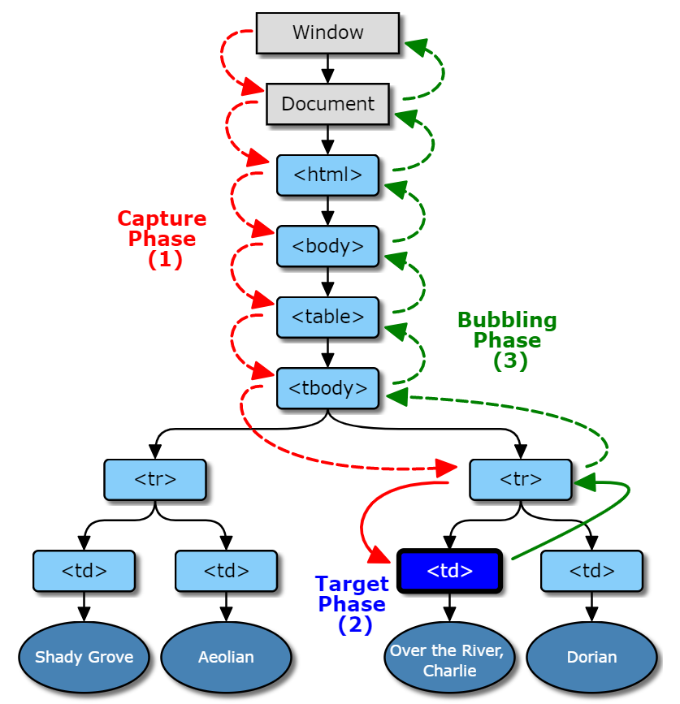
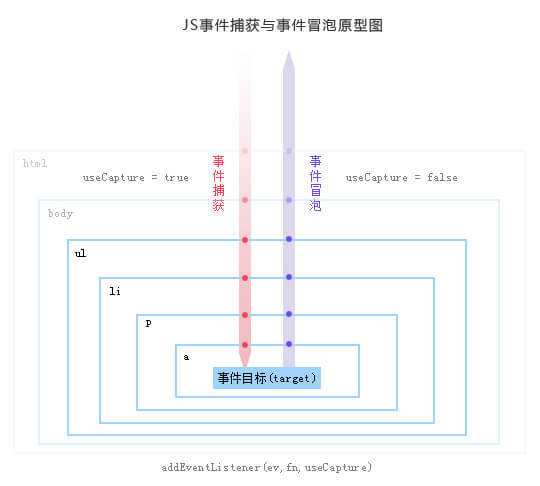

> 什么是模型？

通过主观意识借助实体或者虚拟表现构成客观阐述形态结构的一种表达目的的物件（物件并不等于物体，不局限于实体与虚拟、不限于平面与立体）。（copy百度百科）

> 很多文章把**事件流**也称做**事件模型**，我觉得不贴切。

模型应该是一个可以想象的物件。而其文中解释的却是事件由监听到触发的过程。所以称之为模型，让人难以理解。称之为流，更为贴切。

<!--more-->

# 一、注册事件监听器
有三种方式可以为DOM元素注册事件处理函数。
## (1) HTML 属性
```js
<button id="btn" onclick="doSomething()">
// 等同于
btn.setAttribute('onclick', 'doSomething()');
```
- 使用这个方法指定的监听代码，只会在冒泡阶段触发。

## (2) DOM 元素属性
```js
btn.onclick = doSomethig
```
- 使用这个方法指定的监听函数，也是只会在冒泡阶段触发。

## (3) EventTarget.addEventListener
```js
window.addEventListener('load', doSomething, false);
```
- 所有 DOM 节点实例都有addEventListener方法，用来为该节点定义事件的监听函数。

## (4) 小结
1. 第一种方法，违反了HTML与JS代码相分离的原则，将两者写在一起，不利于代码分工，因此不推荐使用。
2. 第二种方法的缺点在于，同一个事件只能定义一个监听函数，也就是说，如果定义两次onclick属性，后一次定义会覆盖前一次。因此，也不推荐使用。
3. 第三种EventTarget.addEventListener是推荐的指定监听函数的方法。它有如下优点：
   - 同一个事件可以添加多个监听函数。
   - 能够指定在哪个阶段（捕获阶段还是冒泡阶段）触发监听函数。
   - 除了 DOM 节点，其他对象（比如window、XMLHttpRequest等）也有这个接口，它等于是整个 JavaScript 统一的监听函数接口。
4. 三种监听函数内部的this指向触发事件的那个元素节点。

# 二、事件的传播
## (1) 一个事件发生后，会在子元素和父元素之间传播（propagation）。这种传播分成三个阶段。
- 第一阶段：从window对象传导到目标节点（上层传到底层），称为“捕获阶段”（capture phase）。
- 第二阶段：在目标节点上触发，称为“目标阶段”（target phase）。
- 第三阶段：从目标节点传导回window对象（从底层传回上层），称为“冒泡阶段”（bubbling phase）。
## (2) DOM事件流在DOM树中调度的事件的图形表示

<div style="display:flex">
  
  
</div>

# 三、事件的代理
利用事件传播**冒泡阶段**的特点，可以把子节点的监听函数定义在父节点上，由父节点的监听函数统一处理多个子元素的事件。这种方法叫做事件的代理（delegation）。
```js
var ul = document.querySelector('ul');
ul.addEventListener('click', function (event) {
  if (event.target.tagName.toLowerCase() === 'li') {
    // some code
  }
});
```
## (1) 利用事件对象的stopPropagation方法，阻止事件传播
- 捕获阶段阻止
```js
// 事件传播到 p 元素后，就不再向下传播了
p.addEventListener('click', function (event) {
  event.stopPropagation();
}, true);
```
- 冒泡阶段阻止
```js
// 事件冒泡到 p 元素后，就不再向上冒泡了
p.addEventListener('click', function (event) {
  event.stopPropagation();
}, false);
```
## (2) 利用事件对象的stopImmediatePropagation方法，彻底取消事件，就像没发生一样
stopPropagation方法只能阻止这个事件的传播，不会阻止该事件触发节点的其他相同事件的监听函数。
```js
p.addEventListener('click', function (event) {
  event.stopImmediatePropagation();
  console.log(1);
});

p.addEventListener('click', function(event) {
  // 不会被触发
  console.log(2);
});
```
## (3) 事件代理优缺点
### 优点
- 减少事件注册，节省内存。比如，
    - 在table上代理所有td的click事件。
    - 在ul上代理所有li的click事件。
- 简化了dom节点更新时，相应事件的更新。比如
    - 不用在新添加的li上绑定click事件。
    - 当删除某个li时，不用移解绑上面的click事件。
### 缺点
- 事件委托基于冒泡，对于不冒泡的事件不支持。
- 层级过多，冒泡过程中，可能会被某层阻止掉。
- 理论上委托会导致浏览器频繁调用处理函数，虽然很可能不需要处理。所以建议就近委托，比如在table上代理td，而不是在document上代理td。
- 把所有事件都用代理就可能会出现事件误判。比如，在document中代理了所有button的click事件，另外的人在引用改js时，可能不知道，造成单击button触发了两个click事件。


# 四、EventTarget 接口
DOM 的事件操作（监听和触发），都定义在EventTarget接口。所有节点对象都部署了这个接口，其他一些需要事件通信的浏览器内置对象（比如，XMLHttpRequest、AudioNode、AudioContext）也部署了这个接口。  
> 该接口主要提供三个实例方法：

- addEventListener：绑定事件的监听函数
- removeEventListener：移除事件的监听函数
- dispatchEvent：触发事件

## (1) target.addEventListener(type, listener[, useCapture]);
`EventTarget.addEventListener()`用于在当前节点或对象上，定义一个特定事件的监听函数。一旦这个事件发生，就会执行监听函数。该方法没有返回值。
```js
var btn = document.getElementById('btn');
btn.addEventListener('click', doSomething, false);
```
### 该方法接受三个参数。
- type：事件名称，大小写敏感。
- listener：监听函数。事件发生时，会调用该监听函数。
- useCapture：(可选)布尔值，表示监听函数是否在捕获阶段（capture）触发，默认为false（监听函数只在冒泡阶段被触发）。

### 关于参数，有两个地方需要注意。
1. 第二个参数除了监听函数，还可以是一个具有handleEvent方法的对象。
    ```js
    btn.addEventListener('click', {
      handleEvent: function (event) {
        console.log('click');
      }
    });
    ```
2. 其次，第三个参数除了布尔值useCapture，还可以是一个属性配置对象。该对象有以下属性。
  - capture：布尔值，表示该事件是否在捕获阶段触发监听函数。
  - once：布尔值，表示监听函数是否只触发一次，然后就自动移除。
  - passive：布尔值，表示监听函数不会调用事件的preventDefault方法。如果监听函数调用了，浏览器将忽略这个要求，并在监控台输出一行警告。
    ```js
    element.addEventListener('click', function (event) {
        // 只执行一次的代码
      }, {once: true});
    ```
### 监听函数内部的this，指向当前事件所在的那个对象
```js
var btn = document.getElementById('btn');
btn.addEventListener('click', function(){
  this === btn   // true
}, false);
```

## (2) EventTarget.removeEventListener()
`EventTarget.removeEventListener`方法用来移除`addEventListener`方法添加的事件监听函数。该方法没有返回值。
```js
div.addEventListener('click', listener, false);
div.removeEventListener('click', listener, false);
```
`removeEventListener`方法的参数，必须与`addEventListener`方法完全一致。它的第一个参数“事件类型”，大小写敏感。

## (3) EventTarget.dispatchEvent()
`EventTarget.dispatchEvent`方法在当前节点上触发指定事件，从而触发监听函数的执行。  
该方法返回一个布尔值，只要有一个监听函数调用了Event.preventDefault()，则返回值为false，否则为true。

### dispatchEvent方法的参数是一个[Event对象](https://wangdoc.com/javascript/events/event.html)的实例
```js
para.addEventListener('click', hello, false);
var event = new Event('click');
para.dispatchEvent(event);
```


# 五、Event 对象
事件发生以后，会产生一个事件对象，作为参数传给监听函数。浏览器原生提供一个Event对象，所有的事件都是这个对象的实例，或者说继承了Event.prototype对象。
## (1) Event对象本身就是一个构造函数，可以用来生成新的实例。
```js
let event = new Event(type, options);
```
### Event构造函数接受两个参数
- **type：** 是字符串，表示事件的名称
- **options：** 是一个对象，表示事件对象的配置。该对象主要有下面两个属性。
  - bubbles：布尔值，可选，默认为false，表示事件对象是否冒泡。
  - cancelable：布尔值，可选，默认为false，表示事件是否可以被取消，即能否用Event.preventDefault()取消这个事件。

> 注意，如果不是显式指定bubbles属性为true，生成的事件就只能在“捕获阶段”触发监听函数。

```js
// HTML 代码为
// <div><p>Hello</p></div>
var div = document.querySelector('div');
var p = document.querySelector('p');

function callback(event) {
  var tag = event.currentTarget.tagName;
  console.log('Tag: ' + tag); // 没有任何输出
}

div.addEventListener('click', callback, false);

var click = new Event('click');
p.dispatchEvent(click);
div.dispatchEvent(click);
```
- 上面代码中，监听函数不会触发。如果写成`div.addEventListener('click', callback, true)`，才可以在“捕获阶段”监听到这个事件。
- 另一方面，如果这个事件在div元素上触发: `div.dispatchEvent(click)`。因为这时div元素是事件的目标，不存在是否冒泡的问题，div元素总是会接收到事件，因此导致监听函数生效。

## (2) 实例属性
| 属性                   | 值类型      | 默认值                                                                                             | 描述                                                                                                               |
| ---------------------- | ----------- | -------------------------------------------------------------------------------------------------- | ------------------------------------------------------------------------------------------------------------------ |
| Event.bubbles          | 布尔值      | false                                                                                              | 表示当前事件是否会冒泡                                                                                             |
| Event.eventPhase       | 整数常量    | 0，事件目前没有发生。<br>1，事件目前处于捕获阶段。<br>2，事件到达目标节点。<br>3，事件处于冒泡阶段 | 表示事件目前所处的阶段                                                                                             |
| Event.cancelable       | 布尔值      | false                                                                                              | 表示事件是否可以取消，当Event.cancelable属性为true时，调用`Event.preventDefault()`就可以取消这个事件该，属性只读。 |
| Event.cancelBubble     | 布尔值      | false                                                                                              | Event.stopPropagation() 以前的别名。                                                                               |
| Event.defaultPrevented | 布尔值      | false                                                                                              | 表示该事件是否调用过Event.preventDefault方法。该属性只读。                                                         |
| Event.currentTarget    | dom节点对象 | null                                                                                               | 返回事件当前所在的节点，即正在执行的监听函数所绑定的那个节点。                                                     |
| Event.target           | dom节点对象 | null                                                                                               | 返回原始触发事件的那个节点                                                                                         |
| Event.type             | 字符串      | 生成事件的时候指定的值                                                                             | 表示事件类型。该属性只读。                                                                                         |
| Event.timeStamp        | 数值        | 返回一个毫秒时间戳                                                                                 | 表示事件发生的时间。它是相对于网页加载成功开始计算的。                                                             |
| Event.isTrusted        | 布尔值      | false                                                                                              | 表示该事件是否由真实的用户行为产生。                                                                               |
| Event.detail           | 数值        | -                                                                                                  | 属性只有浏览器的 UI （用户界面）事件才具有。该属性返回一个数值，表示事件的某种信息。具体含义与事件类型相关。       |

## (3) 实例方法
- **Event.preventDefault：** 方法取消浏览器对当前事件的默认行为。
- **stopPropagation：** 方法阻止事件在 DOM 中继续传播，防止再触发定义在别的节点上的监听函数，但是不包括在当前节点上其他的事件监听函数。
- **Event.stopImmediatePropagation：** 方法阻止同一个事件的其他监听函数被调用，不管监听函数定义在当前节点还是其他节点。也就是说，该方法阻止事件的传播，比Event.stopPropagation()更彻底。
- **Event.composedPath：** 返回一个数组，成员是事件的最底层节点和依次冒泡经过的所有上层节点。
# 参考
*https://www.w3.org/TR/DOM-Level-3-Events/#dom-event-architecture*
*https://developer.mozilla.org/zh-CN/docs/Web/API/Event*
*https://wangdoc.com/javascript/events/index.html*
*https://zhuanlan.zhihu.com/p/26536815*